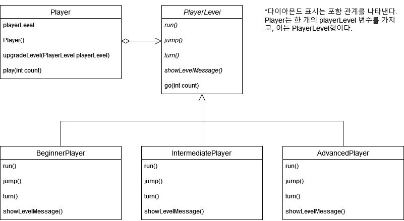

## 추상화 클래스와 템플릿 메서드
> Player가 있고 Player는 PlayerLevel 속성을 가진다. 각 레벨 단계에서 run(), jump(), turn() 이 세 가지 기능이 업그레이드된다.
- 초급자 레벨: 천천히 달린다. run()만 가능.
- 중급자 레벨: 빠르게 달리고 점프를 할 수 있다. run(), jump() 가능.
- 고급자 레벨: 엄청 빠르게 달리고 점프와 턴을 할 수 있다. run(), jump(), turn() 가능.
- Player는 한 번에 하나의 레벨 상태만 가질 수 있다.

